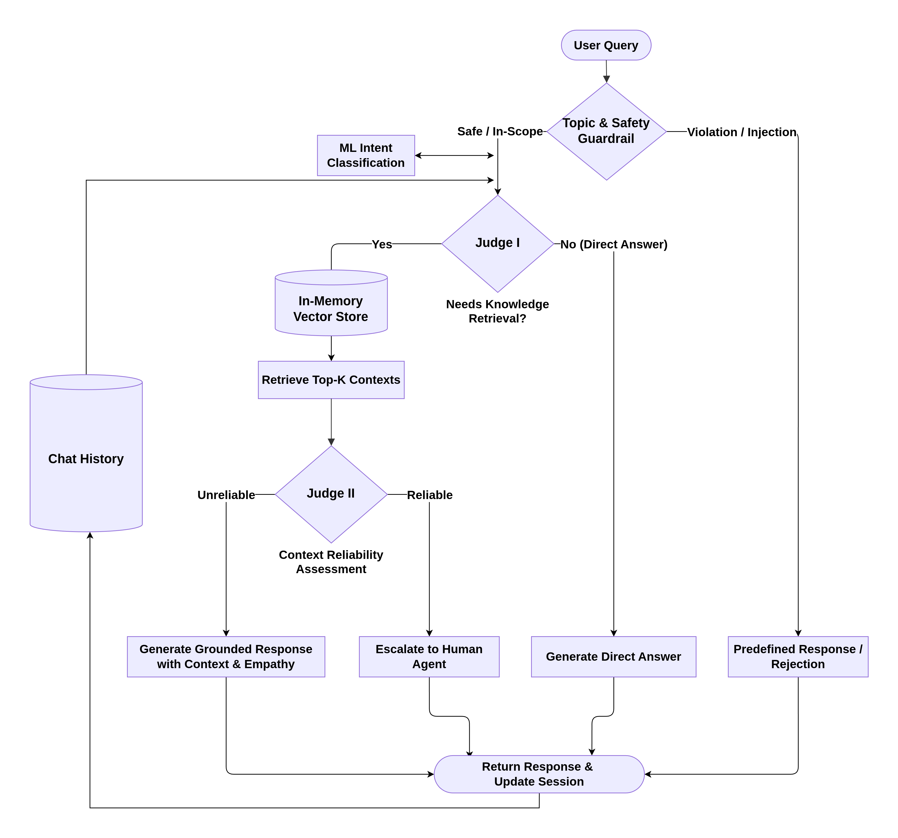

# Amazon Customer Support AI Agent & RAG Pipeline

An enterprise-ready, intelligent customer support AI agent designed for e-commerce query resolution. Built with **Bun**, **LangChain**, and **FastEmbed ONNX**, the system incorporates multi-layered safety guardrails, machine learning intent classification, hybrid retrieval-augmented generation (RAG), and a dual LLM-as-a-Judge architecture to deliver reliable, context-aware responses or seamlessly escalate to human agents.

---

## Features & Architecture

<!-- Workflow figure -->


### Key Highlights
- **Layered Topic & Security Guardrails**: Fast token & regex filtering + semantic fallback protecting against out-of-scope topics, prompt injections, and jailbreaks.
- **ML Intent Classifier**: Classification model sourced from [`lucashmateo/customer-support-twiter-analysis`](https://huggingface.co/lucashmateo/customer-support-twiter-analysis) - converted to ONNX for TS inference, classifying queries into `complaint`, `question`, `positive`, and `other`.
- **Dual LLM-as-a-Judge Evaluation**:
  - **Judge 1 (Need for Knowledge)**: Evaluates whether a query can be answered directly using conversational memory or requires external domain knowledge.
  - **Judge 2 (Reliability Assessment)**: Checks if retrieved knowledge base articles accurately answer the customer's query before generating responses, preventing hallucinations.
- **Local In-Memory Vector Store**: Zero-API-cost semantic search powered by FastEmbed ONNX embeddings and cosine similarity.
- **Stateful Multi-Turn Sessions**: Maintains conversation history, tracking user intent changes and action statuses (`resolve` vs `escalated_to_human`).
- **Automated Evaluation Suite**: Built-in benchmark harness to evaluate intent classification, action prediction, and response accuracy against test datasets.

---

## Setup & Installation

### Prerequisites
- **[Bun](https://bun.sh/)** (`v1.1+` or `v1.4+`)
- Access to an OpenAI-compatible LLM endpoint

### 1. Clone the Repository
```bash
git clone https://github.com/iam-tsr/amazon-customer-support-bot.git
cd amazon-customer-support-bot
```

### 2. Install Dependencies

**Bun dependencies:**
```bash
bun install
```

### 3. Configure Environment Variables
Create a `.env` file in the root directory by copying the sample configuration:

```bash
cp .env.example .env
```

Edit `.env` with your credentials:
```env
OPENAI_API_KEY=your_api_key_here
OPENAI_API_BASE_URL=https://api.openai.com/v1
OPENAI_MODEL=gpt-4o-mini

HOST=0.0.0.0
PORT=3000
```

---

## Usage

### Starting the Server
Start the HTTP server with Bun:

```bash
bun run main.ts
```

Upon startup, the knowledge base entries are vectorized and indexed in-memory. Once ready, the server listens at `http://localhost:3000`.

---

## API Reference

### 1. Chat with Agent
Send customer queries and receive contextually grounded answers.

- **Endpoint**: `POST /chat`
- **Request Body**:
  ```json
  {
    "sessionId": "user_session_123",  // Optional: auto-generated if omitted
    "message": "Where is my Amazon package for order #123-4567890?"
  }
  ```
- **Response**:
  ```json
  {
    "sessionId": "user_session_123",
    "intent": "question",
    "action": "resolve",
    "response": "I would be happy to help you track your package. Please allow me a moment to check your order details..."
  }
  ```

---

### 2. Run Automated Evaluation Test
Triggers evaluation against test datasets to benchmark intent accuracy, action accuracy, and response quality.

- **Endpoint**: `POST /test`
- **Request Body**:
  ```json
  {
    "concurrency": 3,
    "limit": 50
  }
  ```
- **Response**:
  ```json
  {
    "total": 50,
    "intentAccuracy": 0.94,
    "actionAccuracy": 0.92,
    "responseAccuracy": 0.88,
    "results": [...]
  }
  ```

---

## Benchmark Results

Evaluation results from the test suite ([`iam-tsr/amazon-customer-support`](https://huggingface.co/datasets/iam-tsr/amazon-customer-support)) across **100 evaluated customer query test samples**:

| Metric | Score | Passed / Total | Description |
|---|:---:|:---:|---|
| **Response Semantic Accuracy** | **85.0%** | 85 / 100 | Evaluates whether generated responses maintain semantic fidelity ($\ge 0.80$ embedding cosine similarity) with ground-truth target responses. |
| **Action Accuracy** | **76.0%** | 76 / 100 | Accuracy in predicting whether to resolve the query (`resolve`) or escalate to a human agent (`escalated_to_human`). |
| **Intent Classification Accuracy** | **77.0%** | 77 / 100 | Multi-class intent matching (`complaint`, `question`, `positive`, `other`) evaluated using the ML TF-IDF + Logistic Regression model. |

---

## License

This project is distributed and licensed under the **Apache License 2.0**. See the [LICENSE](LICENSE) file for complete details.
